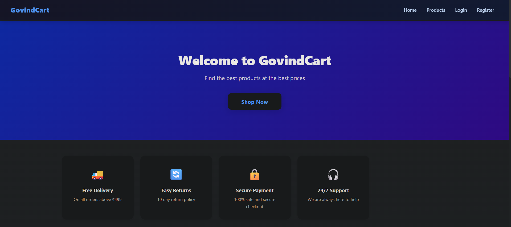
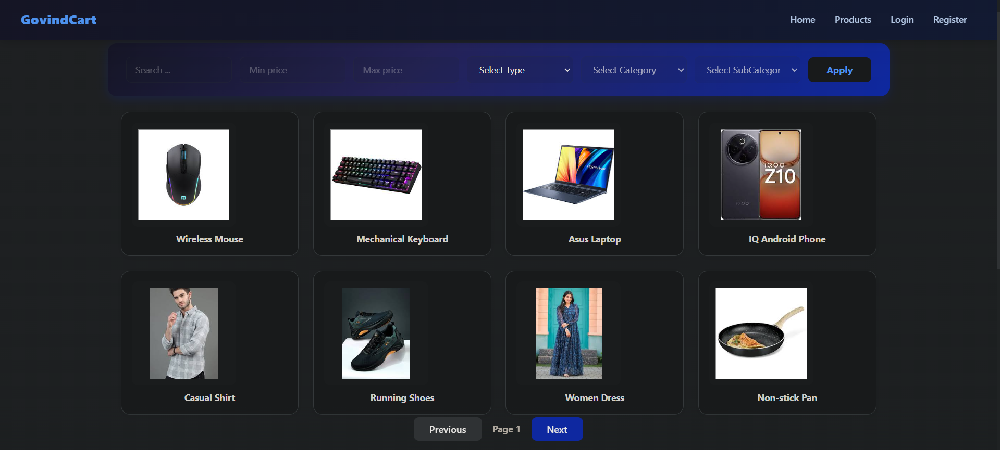
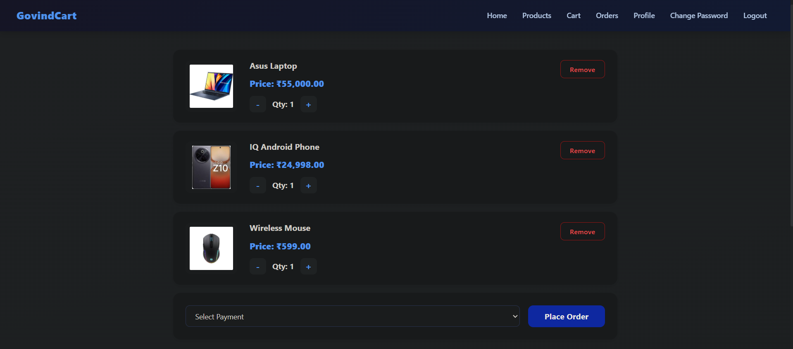
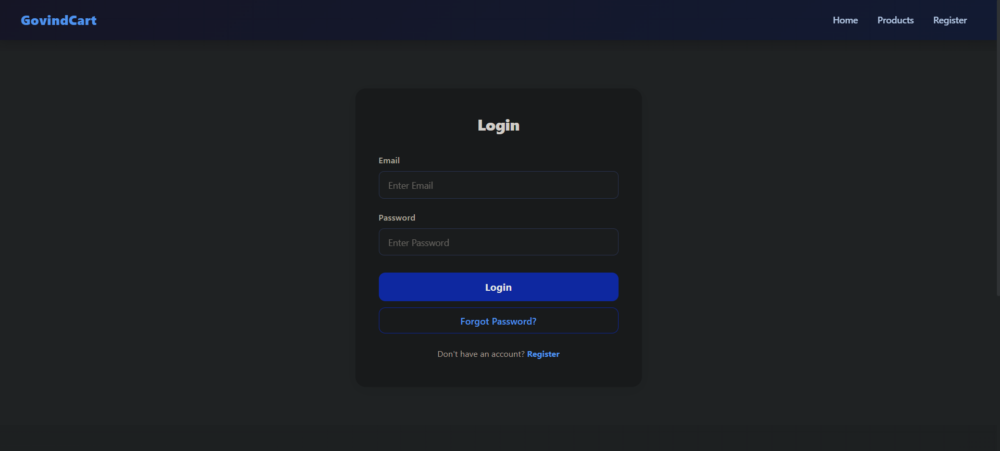

# E-Commerce Project

## Application Screenshots

### Home Page

### Products Page

### Cart Page

### Login Page

---

## How to Run (Production - Single Server)

cd ecommerce-backend
npm install
npm start

Open http://localhost:3000

---

## How to Run (Development - Two Servers)

### Backend
cd ecommerce-backend
npm install
npm start

### Frontend
cd ecommerce-frontend
npm install
ng serve

Open http://localhost:4200

---

## Test Credentials

### Admin
Email: admin@test.com
Password: 123456

### Customer Accounts
All customers have password: 123456

| ID | Name   | Email           | Status |
|----|--------|--------|--------|
| 1  | Govind | govind@test.com | Active |
| 2  | Rahul  | rahul@test.com  | Active |
| 3  | Amit   | amit@test.com   | Active |
| 4  | Sneha  | sneha@test.com  | Active |
| 5  | Priya  | priya@test.com  | Locked |

> Note: Priya's account is locked by default to demonstrate the account locking feature.

---

## Notes

- Database file is included. Admin and customer users are already seeded.
- Angular build is already copied to ecommerce-backend/public/
- For production just run backend and open http://localhost:3000
- No database setup required. SQLite file is included.
